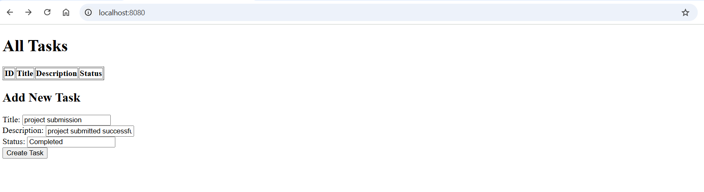

# 📝 Task Tracker Application

A simple Task Tracker web application built with **Spring Boot**, **Spring Data JPA**, **H2 Database**, and **Thymeleaf** for managing tasks with basic CRUD operations.

---

## 🚀 Features

- Create new tasks with title, description, and status
- View a list of all tasks
- Update task details
- Delete existing tasks
- In-memory H2 database for lightweight development
- Simple and responsive UI using Thymeleaf

---

## 🛠️ Technologies Used

- Java 17
- Spring Boot
- Spring Data JPA
- Thymeleaf
- H2 Database
- Maven
- IntelliJ IDEA

---

## 📸 UI Preview

> Simple task creation form and task list displayed on the homepage.



---
## Step-By-Step RoadMap
✅ Phase 1: Setup Backend with Spring Boot
- Create a Spring Boot project using Spring Initializr

- Dependencies: Spring Web, Spring Data JPA, H2 or MySQL

- Build a Task model (id, title, description, status)
- - Mapped to a database table called tasks using @Entity and @Table(name = "tasks")
- - @GeneratedValue will auto-generate primary key id using @id
- - we used @Column(nullable = false) annotation for fields title and status(pending/completed)
  - 

- Create a TaskRepository using Spring Data JPA

- Add a TaskController with REST endpoints:

- GET /tasks

- POST /tasks

- PUT /tasks/{id}

- DELETE /tasks/{id}

---

## ⚙️ How to Run Locally

### 1. Clone the Repository

```bash
git clone https://github.com/lakkakulaprashanth/Task-Tracker.git
cd Task-Tracker
